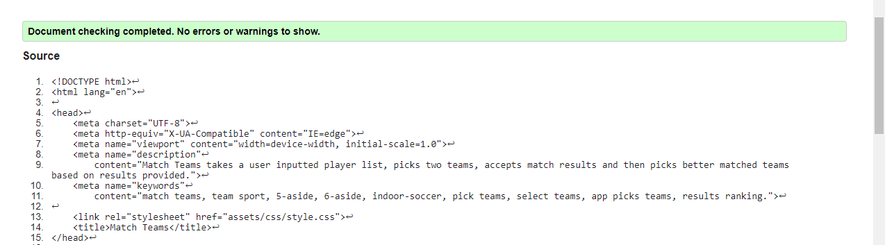
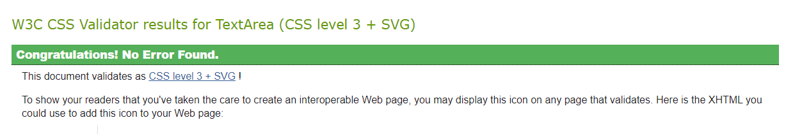
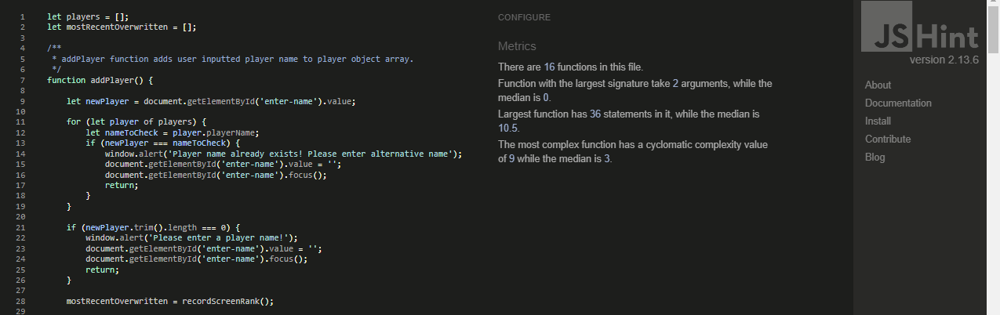
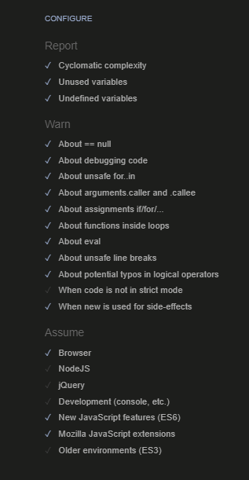
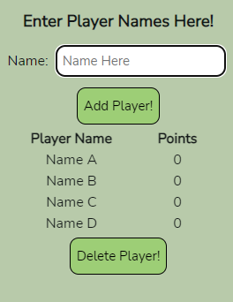
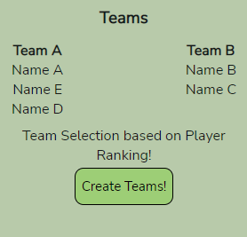
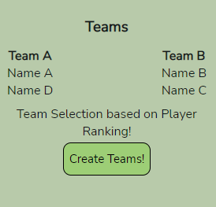
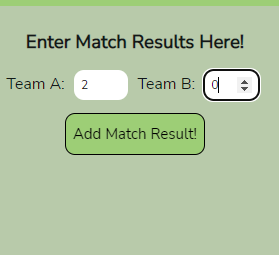
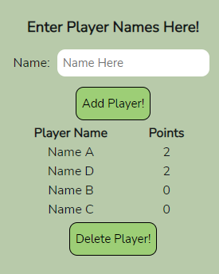
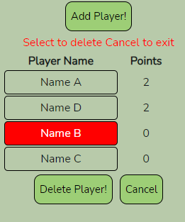

# Portfolio Project 2 - Match Teams README
## 1. Purpose of the project

Match Teams is designed for groups playing non-competitive team sports for fun. It allows the user to enter participants' names and the application can then create two teams from the player list. Match results can be entered and this updates player points and therefore the player rankings. Subsequent team selections are based on the latest player rankings with the aim of picking more evenly matched teams.

Player points awarded are based purely on the score difference in a given match with all players on the winning side awarded the same points. This was considered the best approach in pursuit of a Minimum Viable Product and further refinement could be considered in the future. This is discussed in more detail below.

## 2. user stories

1. As a visiting user I want to be able to add players to a player list.
2. As a visiting user I want the application to create two teams using all players on the list. As we are playing for fun all players will play each match even if the numbers are uneven. No player is asked to sit out a match.
3. As a visiting user I want to be able to add match results and have the application use this information to try to create more evenly balanced teams when I next hit the create teams button.
4. As a visiting user I also need to be able to remove a player from the list if they leave early while the remainder of the group play on.

## 3. Features

Please note that the features section contains relevant extracts from the project wireframes. The complete wireframes are included in section 6 of this document.

### 3.1 Header

* The header contains the application name "Match Teams" and a sub-heading, "Picks Teams so You Don't have to!" to provide a strong initial indication as to what the application does.

Fig. 3.1.1 Mobile Header

Fig. 3.1.2 Desktop Header

### 3.2 Add Players

* Contains an input field for name entry and a submit "Add Player!" button to allow player names to be added to the list of players.

* Prevents the same name being submitted twice or blank name entries being submitted.

* In both the mobile and desktop applications this feature has a promiment position at the top of the screen.

Fig. 3.2.1 Mobile Add Players

Fig. 3.2.2 Desktop Add Players

### 3.3 Player List and Player Delete

* As players are added via the Add Player function the player names appear listed on screen in the player list section.

* The "Delete Player!" button is located just below the player list. This allows the removal of a player from the list at any point.

Fig. 3.3.1 Player List and Player Delete

### 3.4 Create Teams

* The create teams section has a button "Create Teams!". When clicked the application divides the full player list into 2 teams, A & B.

* The two team lists are displayed to screen directly above the "Create Teams!" button.

Fig. 3.4.1 Create Teams

### 3.5 Enter Match Result

* Contains two input fields to take the score from each of the two teams, A & B.

* Has a submit button labelled "Add Match Result!"

Fig. 3.5.1 Enter Match Result

### 3.6 How it Works

* Provides bullet point list describing how to use the application.

* Is located at the bottom of the page.

* On the mobile application it will have to be scrolled to or reached via the footer link.

Fig. 3.6.1 How it Works

### 3.7 Mobile Footer

* On the mobile version a thin horizontal fixed footer is included containing the application name and a link to the how it works section as the how it works may not be visible on smaller devices even at the beginning before adding names and teams.

Fig. 3.7.1 Mobile Footer

## 4. future features

There are a number of features that could be added in time. These generally relate to the method of ranking players through awarding points with a view to refining the process based on additional input and analysis.

1. In addition to providing match results the user could also be provided with the additional optional ability to identify the scorers in a game and how much they scored. Player points could be awarded accordingly. This could allow scoring players on a losing team to gain points.

2. The system could award additional points to players on a winning team if they hold the oposition scoreless. This would award defensive effort.

3. The system could also track the number of wins, draws and loses for each player, provide this information to the user, and add or subtract points accordingly.

In deciding to provide the product initially without any of these features the key consideration is the user the application is aimed at. The product is aimed at the recreational player using the application for fun. They do not expect a detailed analysis or complex system of team selection. Therefore while the additional features outlined above would be interesting and add value they are not expected and therefore the product can and should be deployed in its curent form now.

## 5. Typography and color scheme

### 5.1 Typography

* The chosen font is Nunito Sans with a font-weight of 500. It is considered that it conveys the simple, easy to read approach required.

* The font was chosen from Google Fonts with reference to www.fontpair.co

* The fall-back font is sans-serif.

### 5.2 Color Scheme

* The font-color is #131817 which is close to black and was chosen to ensure the text is easily read on lighter backgrounds.

* All other colors have been chosen to ensure clear contrast with the font-color. Varying shades of green were considered appropriate to a sports related application.

* The background colour is #9dce76. The key consideration is that it does not distract from the site content.

* The background color for the header and footer is #9dce76 and was chosen to provide a degree of contrast from the main body of the page without being radically different. The subtle difference is important particularly for the header which is fixed and would otherwise blend into the background at certain scroll locations.

* The background color for the link hover position is the same as the main background. This provides adequate contrast with the the pre-hover position.

## 6. wireframes

### 6.1 Initial Screen on Mobile Platform

### 6.2 Screen on Mobile after Player List Entry

### 6.3 Screen on Mobile after Team Creation

### 6.4 Screen on Desktop Platform

## 7. technology

The following technologies were used in developing and deploying the website:

* HTML

* CSS

* Javascript

* The IDE used was GITPOD

* The repository used is GITHUB

* The website is deployed on GITHUB pages.

* Testing was carried out using Chrome Developer Tools including lighthouse for responsiveness and accessibility.

* In addition to using Chrome Developer tools for the primary checks of responsiveness, the application was also looked at on the https://ui.dev/amiresponsive website.

* Balsamiq was used to prepare wireframes.

* Google Chrome was used as the main web browser both for accessing the IDE and the repository as well as to view the website application during development.

* Microsoft Edge and Mozilla Firefox were used when testing the site compatibility with other web browsers.

## 8. Testing

   ### 8.1 Code Validation

The code successfully passed html validation:

The code successfully passed css validation:

The code successfully passed javascript (jshint) validation:

The configuration used in jshint was as follows:

### 8.2 Test Cases

 #### 8.2.1 User Story 1

As a visiting user I want to be able to add players to a player list.

This requirement is met by the provision of an input field for the entry of a player name by the user and an Add Player button. The user gets immediate feedback on screen that name entry has happened by the fact of the name appearing on screen.

These features have certain requirements tested as follows:

Test Requirement|Met Requirement when tested
---|:---:
Input field provided for name entry|Yes
Cursor in entry field on initial page load|Yes
Inputted name appears on screen when Add Player! button pressed|Yes
Keyboard "Enter" key will also add player name|Yes
Cursor appears again in a blank entry field after name entry|Yes
Attempting to enter the same name twice will trigger an alert|Yes
Attempting to enter a blank name will trigger an alert|Yes

Fig. 8.2.1.1 Add Player Section

#### 8.2.2 User Story 2

As a visiting user I want the application to create two teams using all players on the list. As we are playing for fun all players will play each match even if the numbers are uneven. No player is asked to sit out a match.

This requirement is met by the provision of a Create Teams! button which when clicked divides the player list into two teams A and B. Team A and Team B are printed to screen above the Create Teams Button!

These features have certain requirements tested as follows:

Test Requirement|Met Requirement when tested
---|:---:
Create Teams button is provided|Yes
When clicked the create teams button prints Team A and Team B to screen|Yes
If player numbers are uneven teams are still created using all players|Yes
Attempting to create teams with 1 or no players returns an alert|Yes

Fig. 8.2.2.1 Create Teams Section

#### 8.2.3 User Story 3

As a visiting user I want to be able to add match results and have the application use this information to try to create more evenly balanced teams when I next hit the create teams button.

This requirement is met by the provision of input fields to add team scores and an Add Match Result! button to submit them. Furthermore the individual player points are displayed in the player list and can be seen to update upon submitting a match result. Finally the Create Teams! button when pressed on again creates teams based on the latest ranking except if the ranking remains unchanged as could occur in the event of a draw or if the score difference in a particular game is too low to impact the current rankings. In this case the teams are changed by shuffling the most recent teams and the user is advised of this on screen.

These features have certain requirements tested as follows:

Test Requirement|Met Requirement when tested
---|:---:
Add Match Result! button is provided|Yes
An input field is provided for each team score|Yes
When scores are entered and the button clicked a confirmation message appears|Yes
If the button is clicked without a number in either field an alert is displayed|Yes
When the result is added the player points in the player list are updated|Yes
When the player points are updated the player list order is updated accordingly|Yes
When the create teams button is next clicked teams are created based on ranking and a message advising of this is displayed|Yes
If the ranking order has not changed clicking the create teams button shuffles the teams and a message advising of this is displayed|Yes
A ranking of players A, B, C, D creates teams A with D and B with C|Yes

Fig. 8.2.3.1 Team Creation based on rank using A with D, B with C split

Fig. 8.2.3.2 Enter match result fields and button

Fig. 8.2.3.3 Player points updated

#### 8.2.4 User Story 4

As a visiting user I also need to be able to remove a player from the list if they leave early while the remainder of the group play on.

This requirement is me by the provision of a delete button that when pressed, highlights each player in the player list allowing an individual player to be clicked on and deleted. A cancel button is also provided to allow the user exit the delete function without deleting a player.

These features have certain requirements tested as follows:

Test Requirement|Met Requirement when tested
---|:---:
Delete Player! button is provided|Yes
When Delete Player! button is pressed all of the players on the player list are highlighted for potential deletion|Yes
A warning message regarding deletion and the cancel option is displayed|Yes
Clicking on a player deletes them from the player list|Yes
Deleted players are also removed from the current displayed teams|Yes
Clicking the cancel button exits the delete function|Yes

Fig. 8.2.4.1 Delete Player

## 8. testing
   8.1 code validation
   8.2 test cases (user story based with screenshots)
   8.3 fixed bugs
   8.4 supported screens and browsers

## 9. Deployment

   ### 9.1 via gitpod

The site was developed in gitpod as follows:

1. From the github repository created for the project (see below) the Gitpod button installed as a chrome browser extension was clicked. A Gitpod workspace was created.

2. Within the workspace explorer the required html file index.html was created.

3. Within the workspace explorer an assets folder was created.

4. Within the assets folder a css folder and a js folder were created.

5. Within the css folder a style.css file was created for the project css.

6. Within the js folder a script.js file was created for the project javascript.

7. Basic template boilerplate html was introduced to index.html and links created to the style.css and script.js files.

8. Coding of the website proceeded using the html, css and javascript coding languages.

9. To view the ongoing development in a seperate browser tab, the command python3-m http.server was entered in the IDE terminal.

10. At regular appropriate intervals the latest version of the code was saved via the git add and git commit commands. Appropriate commit messages were added to control the revisions.

11. The git push command was used to push all committed code and documentation to the repository for secure storing.

   ### 9.2 via github pages

1. The Code Institute project template was accessed on github at https://github.com/Code-Institute-Org/gitpod-full-template and the Use this Template button clicked to create a project specific repository.

2. All files and documents pushed from Gitpod appear in the repository.

3. The website is deployed to github pages as follows:

* From the project repository click on the settings button.

* Then click on Pages in the options listed to the left.

* Chose to deploy from a branch and select the main branch.

* Deploy the page.

* The web page is deployed to github pages and a link to the page is provided. This may take a few minutes.

* Click on the link to access the deployed website. The link can also be copied to anyone needing to access the site as can the repository address.

* Once deployed any further changes pushed from Gitpod will be reflected in the website following a hard refresh of the pages. It may take a few minutes for changes to transfer so it may be necessary to complete a hard refresh after a few minutes if changes do not appear reflected in the latest pages at first.

* The live site can be accessed <a href="https://fenton1000.github.io/mf-portfolio-two-match-teams/" target="_blank">here</a>

## 10. credits

* Code Institute for the Gitpod template provided at https://github.com/Code-Institute-Org/gitpod-full-template allowing easy set up of a repository and workspace as well as initial project html template.

* Code Institute Love Maths example project for general guidance as to mimimun requirements and overview of approach and industry conventions. In particular for guidance on use of Event Listeners, .focus() method, keydown listener and event 'enter', alerts and emptying input fields.

* Google Fonts for imported text font.

* www.fontpair.co for guidance on font options.

* w3schools - www.w3schools.com for information on various javascript methods including event listeners and methods such as event.target and adding and removing class attributes.

* Code Institute Rock Paper Scissors Project and README example for minimun requirements.

* https://ui.dev/amiresponsive for the screen size images in section 8.4 of this README.

* MDN web docs developer.mozilla.org for general guidance on javescript rules and methods and in particular the use of 
 .removeEventListener.

* javascript.tutorial.net for guidance on the process of returning nested arrays from a function.

* Free Code Camp freecodecamp.org, "How to Clone an Array in Javascript" by Yazeed Bzadough for information on passing an array to a new variable.

* Fellow students in the KCETB-Code Institute cohort for the feedback, advice and constant discussion of all things code.

* Ms. Irene Neville, Code Institute cohort facilitator, for the provision of or signposting towards all key pieces of information needed to ensure the successful completion of the project to the required standards.

* Mr. Rohit Sharma (Mentor) for guidance on overall project approach, industry standards and README requirements. Also for specific signposting towards .trim() method and js docs standards.