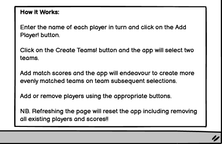

# Portfolio Project 2 - Match Teams README
## 1. Purpose of the project

Match Teams is designed for groups playing non-competitive team sports for fun. It allows the user to enter participants' names and the application can then create two teams from the player list. Match results can be entered and this updates player points and therefore the player rankings. Subsequent team selections are based on the latest player rankings with the aim of picking more evenly matched teams.

Player points awarded are based purely on the score difference in a given match with all players on the winning side awarded the same points. This was considered the best approach in pursuit of a Minimum Viable Product and further refinement could be considered in the future. This is discussed in more detail below.

## 2. user stories

1. As a visiting user I want to be able to add players to a player list.
2. As a visiting user I want the application to create two teams using all players on the list. As we are playing for fun all players will play each match even if the numbers are uneven. No player is asked to sit out a match.
3. As a visiting user I want to be able to add match results and have the application use this information to try to create more evenly balanced teams when I next hit the create teams button.
4. As a visiting user I also need to be able to remove a player from the list if they leave early while the remainder of the group play on.

## 3. Features

Please note that the features section contains relevant extracts from the project wireframes. The complete wireframes are included in section 6 of this document.

### 3.1 Header

* The header contains the application name "Match Teams" and a sub-heading, "Picks Teams so You Don't have to!" to provide a strong initial indication as to what the application does.

Fig. 3.1.1 Mobile Header

Fig. 3.1.2 MDesktop Header

### 3.2 Add Players

* Contains an input field for name entry and a submit "Add Player!" button to allow player names to be added to the list of players.

* Prevents the same name being submitted twice or blank name entries being submitted.

* In both the mobile and desktop applications this feature has a promiment position at the top of the screen. In the desktop version this is in the central column.

#### Fig. 3.2.1 Mobile Add Players

#### Fig. 3.2.2 Desktop Add Players

### 3.3 Player List and Player Delete

* As players are added via the Add Player function the player names appear listed on screen in the player list section.

* Player List is located towards the bottom of screen on mobile devices. Dependant on device size and number of players it may/will move down off screen and require scrolling to be reached after team creation - see below. However it was considered that once Team A and Team B are selected, this becomes the key priority information in limited screen space. Furthermore having seen the list being created during the name entry process, the user should naturally generate an awarness of its existence and know to scroll if necessary.

* On mobile devices the "Delete Player!" button is located just below the player list. This allows the removal of a player from the list at any point.

* On desktop, given the ample space available, the player list is located in the left-hand column.

* On desktop the "Delete Player!" button is located in the cental column at the bottom. Therefore it is removed somewhat from the player list but this was considered a more intuitive location given that all controls are located in the central column on desktop.

#### Fig. 3.3.1 Mobile Player List and Player Delete

#### Fig. 3.3.2 Desktop Player List

### 3.4 Create Teams

* The create teams section has a button "Create Teams!". When clicked the application divides the full player list into 2 teams, A & B.

* In the mobile version of the application the two team lists are displayed to screen directly above the "Create Teams!" button.

* In the destop version the two teams are displayed at the top of the right-hand side of the screen.

#### Fig. 3.4.1 Mobile Create Teams

### 3.5 Enter Match Result

* Contains two input fields to take the score from each of the two teams, A & B.

* Has a submit button labelled "Add Match Result!"

* This area is almost identical in the mobile and desktop versions.

#### Fig. 3.5.1 Mobile Enter Match Result

### 3.6 How it Works

* Provides bullet point list describing how to use the application.

* Is located in the bottom right corner on desktop.

* Is located at the bottom on the mobile application and can be scrolled to or reached via the footer link.

#### Fig. 3.6.1 How it Works

### 3.7 Mobile Footer

* On the mobile version a thin horizontal fixed footer is included containing the application name and a link to the how it works section as the how it works may not be visible on smaller devices even at the beginning before adding names and teams.

#### Fig. 3.7.1 Mobile Footer

## 4. future features

There are a number of features that could be added in time. These generally relate to the method of ranking players through awarding points with a view to refining the process based on additional input and analysis.

1. In addition to providing match results the user could also be provided with the additional optional ability to identify the scorers in a game and how much they scored. Player points could be awarded accordingly. This could allow scoring players on a losing team to gain points.

2. The system could award additional points to players on a winning team if they hold the oposition scoreless. This would award defensive effort.

3. The system could also track the number of wins, draws and loses for each player and add or subtract points accordingly.

In deciding to provide the product initially without any of these features the key consideration is the user the application is aimed at. The product is aimed at the recreational player and the users use of such an application would be for fun. They do not want or expect a detailed analysis.
## 5. Typography and color scheme
## 6. wireframes

### 6.1 Initial Screen on Mobile Platform

### 6.2 Screen on Mobile after Player List Entry

### 6.3 Screen on Mobile after Team Creation

### 6.4 Screen on Desktop Platform

=== 1-6 for planning and then write code ===
## 7. technology
## 8. testing
   8.1 code validation
   8.2 test cases (user story based with screenshots)
   8.3 fixed bugs
   8.4 supported screens and browsers
## 9. Deployment
   9.1 via gitpod
   9.2 via github pages
## 10. credits